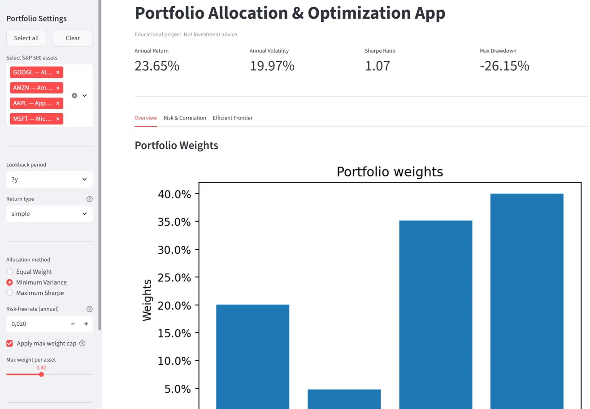
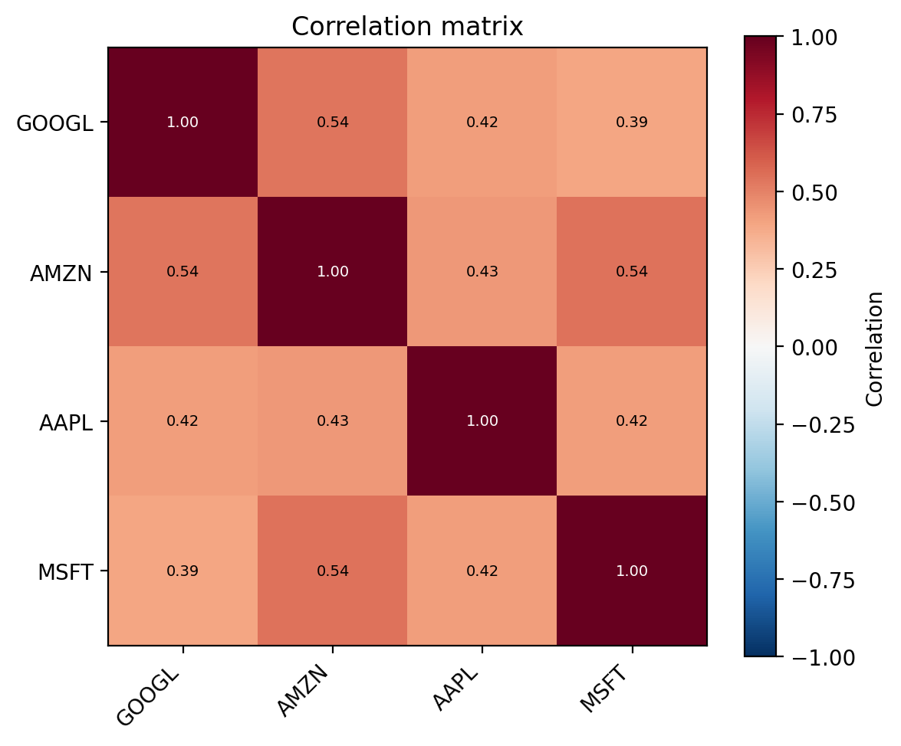

## Disclaimer

This project is for educational purposes only and does not constitute investment advice. The author is not responsible for any financial decisions made based on this project. Data may be delayed or inaccurate.

# Portfolio Allocation & Optimization App

Interactive equity portfolio construction and optimization tool built from scratch in Python. Implements the full Markowitz mean-variance framework with real market data and a Streamlit UI.

---

## Screenshots





---

## Features

- **Asset universe**: full S&P 500 constituents loaded live from Wikipedia, searchable by name or sector
- **Three allocation methods**: equal-weight (1/N), minimum variance, maximum Sharpe ratio
- **Robust covariance estimation**: Ledoit-Wolf shrinkage (scikit-learn) instead of naive sample covariance, ensuring a positive semi-definite matrix even with large asset counts
- **Convex optimization**: portfolio weights solved via CVXPY with long-only constraint and optional per-asset weight cap to avoid concentration
- **Risk metrics**: annualized volatility, Sharpe ratio, maximum drawdown
- **Efficient frontier**: full mean-variance frontier computed point-by-point
- **Interactive UI**: Streamlit dashboard with KPI cards, portfolio weights chart, performance curve, drawdown chart, and correlation heatmap

---

## Methodology

The application implements **mean-variance portfolio theory** (Markowitz, 1952). Portfolio optimization is formulated as a constrained convex problem and solved with CVXPY.

Key design choices:

- **Covariance estimation** — The sample covariance matrix is unreliable when the number of assets is large relative to the number of observations. Ledoit-Wolf shrinkage provides a well-conditioned, positive semi-definite estimator that improves out-of-sample stability.
- **Weight constraints** — All portfolios are long-only (w ≥ 0). An optional maximum weight cap (e.g. 40%) prevents single-asset concentration, which is standard practice in institutional portfolio management.
- **Max Sharpe reformulation** — The maximum Sharpe ratio portfolio is solved via the standard convex reformulation: maximize excess return subject to a quadratic risk constraint, then normalize weights.
- **Efficient frontier** — Computed by solving a series of minimum-variance problems with increasing return floor constraints.

All results are evaluated on historical data. Past performance does not predict future results.

---

## Project Structure

```
Portfolio-Allocation-App/
├── app.py                  ← Streamlit UI: sidebar, tabs, KPI display
├── requirements.txt
├── .gitignore
├── .gitattributes
├── README.md
├── notebook/
│   └── exploration.ipynb   ← Initial data exploration and prototyping
└── src/
    ├── __init__.py
    ├── data.py             ← Price download (yfinance) + S&P 500 table loader
    ├── analytics.py        ← Returns, correlation, Ledoit-Wolf covariance
    ├── optimization.py     ← Equal-weight, min variance, max Sharpe, efficient frontier (CVXPY)
    ├── plotting.py         ← All matplotlib figures (weights, performance, drawdown, heatmap, frontier)
    └── risk.py             ← Portfolio volatility, drawdown series, max drawdown
```

Strict separation between business logic (`src/`) and UI (`app.py`). All computation functions are pure (no Streamlit side effects) and independently testable.

---

## Technologies

| Library | Role |
|---|---|
| **pandas / numpy** | Data manipulation and linear algebra |
| **yfinance** | Historical market data (adjusted close prices) |
| **scikit-learn** | Ledoit-Wolf covariance shrinkage estimator |
| **cvxpy** | Convex optimization solver for portfolio weights |
| **matplotlib** | Static visualizations (all functions return `fig`, never call `plt.show()`) |
| **Streamlit** | Interactive web UI |
| **requests / lxml** | S&P 500 constituents scraping from Wikipedia |

---

## Quickstart

**Python 3.11+ recommended**

```bash
pip install -r requirements.txt
streamlit run app.py
```

---

## What I Learned

- Translating financial theory (Markowitz framework) into working, constrained optimization code
- Why naive sample covariance fails in practice and how shrinkage estimators solve it
- Structuring a Python project with clean separation between data, computation, visualization, and UI layers
- Building an interactive financial tool with Streamlit that handles edge cases (invalid tickers, large universes, solver failures)
